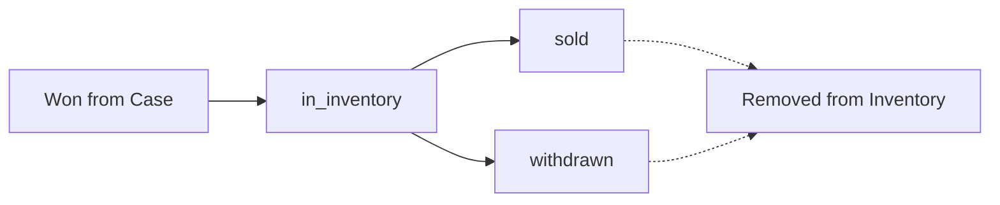

## Overview

The inventory system tracks all items won by users from case openings. Items can be sold for balance, withdrawn, or kept in inventory. Each item has a status that determines its current state in the system.

## Database Schema

### Items Table

Master catalog of all possible items:

```sql
create table public.items (
  id uuid default uuid_generate_v4() primary key,
  name text not null,
  image_url text,
  rarity text not null,        -- common, rare, epic, legendary
  price numeric not null,      -- Base value in ARS
  created_at timestamp with time zone default now() not null
)
```

### User Items Table

Tracks ownership and status:

```sql
create table public.user_items (
  id uuid default uuid_generate_v4() primary key,
  user_id uuid references public.users not null,
  item_id uuid references public.items not null,
  status text default 'in_inventory',  -- Item lifecycle status
  created_at timestamp with time zone default now() not null
)
```

### Case Items Table

Defines which items can be won from which cases:

```sql
create table public.case_items (
  id uuid default uuid_generate_v4() primary key,
  case_id uuid references public.cases not null,
  name text not null,          -- Item name (denormalized)
  value number not null,       -- Item value
  image_url text not null,
  probability number not null, -- Drop chance percentage
  created_at timestamp with time zone default now() not null
)
```

<Note>
The current schema has `case_items` with denormalized data (name, value, image_url). This allows case items to have different values than the base item.
</Note>

## Item Status Lifecycle

<Steps>
  <Step title="in_inventory" icon="box">
    Item is freshly won and sitting in user's inventory. Can be sold or withdrawn.
  </Step>
  <Step title="sold" icon="sack-dollar">
    Item has been sold for balance. No longer available to user.
  </Step>
  <Step title="withdrawn" icon="truck">
    Item has been withdrawn/shipped to user. Permanent state.
  </Step>
</Steps>



## Adding Items to Inventory

When a user wins an item from a case:

```typescript app/api/cases/open/route.ts
// After determining winner from provably fair calculation
const winnerItem = getWinningItem(mappedItems, rollValue)

// Add to user's inventory
await supabase.from('user_items').insert({
  user_id: user.id,
  item_id: winnerItem.id,
  status: 'in_inventory'
})

// Alternative: If using denormalized case_items
// You might need to create the item record first
const { data: itemRecord } = await supabase
  .from('items')
  .select('*')
  .eq('name', winnerItem.name)
  .eq('price', winnerItem.value)
  .single()

if (!itemRecord) {
  // Create item if doesn't exist
  const { data: newItem } = await supabase
    .from('items')
    .insert({
      name: winnerItem.name,
      image_url: winnerItem.image_url,
      rarity: winnerItem.rarity,
      price: winnerItem.value
    })
    .select()
    .single()
  
  await supabase.from('user_items').insert({
    user_id: user.id,
    item_id: newItem.id,
    status: 'in_inventory'
  })
}
```

## Fetching Inventory

Retrieve all items in a user's inventory:

```typescript
const { data: inventory } = await supabase
  .from('user_items')
  .select(`
    id,
    status,
    created_at,
    items (
      id,
      name,
      image_url,
      rarity,
      price
    )
  `)
  .eq('user_id', user.id)
  .eq('status', 'in_inventory')
  .order('created_at', { ascending: false })

// Returns:
// [
//   {
//     id: "user-item-uuid",
//     status: "in_inventory",
//     created_at: "2026-03-04T10:30:00Z",
//     items: {
//       id: "item-uuid",
//       name: "Dragon Lore AWP",
//       image_url: "https://...",
//       rarity: "legendary",
//       price: 15000
//     }
//   }
// ]
```

<Info>
Supabase automatically joins the `items` table when you use the nested select syntax.
</Info>

## Selling Items

Convert inventory items to balance:

```typescript app/api/inventory/sell/route.ts
import { createClient } from '@/lib/supabase/server'
import { NextResponse } from 'next/server'

export async function POST(request: Request) {
  const supabase = await createClient()
  const { data: { user } } = await supabase.auth.getUser()
  
  if (!user) {
    return NextResponse.json({ error: 'Unauthorized' }, { status: 401 })
  }
  
  const { userItemId } = await request.json()
  
  // 1. Fetch the item with ownership verification
  const { data: userItem, error: fetchError } = await supabase
    .from('user_items')
    .select('*, items(*)')
    .eq('id', userItemId)
    .eq('user_id', user.id)  // Ensure ownership
    .eq('status', 'in_inventory')  // Can only sell items in inventory
    .single()
  
  if (fetchError || !userItem) {
    return NextResponse.json(
      { error: 'Item not found or already sold' },
      { status: 404 }
    )
  }
  
  const itemValue = userItem.items.price
  
  // 2. Update item status to 'sold'
  const { error: updateError } = await supabase
    .from('user_items')
    .update({ status: 'sold' })
    .eq('id', userItemId)
  
  if (updateError) {
    return NextResponse.json(
      { error: 'Failed to update item' },
      { status: 500 }
    )
  }
  
  // 3. Add value to user balance
  const { data: userData } = await supabase
    .from('users')
    .select('balance')
    .eq('id', user.id)
    .single()
  
  await supabase
    .from('users')
    .update({ balance: userData.balance + itemValue })
    .eq('id', user.id)
  
  // 4. Record transaction
  await supabase.from('transactions').insert({
    user_id: user.id,
    amount: itemValue,
    type: 'item_sell',
    reference_id: userItem.item_id
  })
  
  return NextResponse.json({
    success: true,
    item_name: userItem.items.name,
    amount_received: itemValue,
    new_balance: userData.balance + itemValue
  })
}
```

## Bulk Sell

Sell multiple items at once:

```typescript
export async function POST(request: Request) {
  const { userItemIds } = await request.json()  // Array of IDs
  
  // Fetch all items
  const { data: items } = await supabase
    .from('user_items')
    .select('*, items(*)')
    .in('id', userItemIds)
    .eq('user_id', user.id)
    .eq('status', 'in_inventory')
  
  if (!items || items.length === 0) {
    return NextResponse.json(
      { error: 'No valid items to sell' },
      { status: 400 }
    )
  }
  
  // Calculate total value
  const totalValue = items.reduce(
    (sum, item) => sum + item.items.price,
    0
  )
  
  // Update all items to sold
  await supabase
    .from('user_items')
    .update({ status: 'sold' })
    .in('id', userItemIds)
  
  // Update balance
  const { data: userData } = await supabase
    .from('users')
    .select('balance')
    .eq('id', user.id)
    .single()
  
  await supabase
    .from('users')
    .update({ balance: userData.balance + totalValue })
    .eq('id', user.id)
  
  // Record transaction
  await supabase.from('transactions').insert({
    user_id: user.id,
    amount: totalValue,
    type: 'item_sell',
    reference_id: null  // Multiple items
  })
  
  return NextResponse.json({
    success: true,
    items_sold: items.length,
    total_value: totalValue
  })
}
```

## Inventory Filters

Filter inventory by rarity or value:

```typescript
// By rarity
const { data: legendaryItems } = await supabase
  .from('user_items')
  .select('*, items!inner(*)')  // !inner makes it an INNER JOIN
  .eq('user_id', user.id)
  .eq('status', 'in_inventory')
  .eq('items.rarity', 'legendary')

// By minimum value
const { data: highValueItems } = await supabase
  .from('user_items')
  .select('*, items!inner(*)')
  .eq('user_id', user.id)
  .eq('status', 'in_inventory')
  .gte('items.price', 5000)  // Items worth 5000+ ARS
```

## Inventory Statistics

Calculate inventory metrics:

```typescript
const { data: inventory } = await supabase
  .from('user_items')
  .select('*, items(*)')
  .eq('user_id', user.id)
  .eq('status', 'in_inventory')

const stats = {
  total_items: inventory.length,
  total_value: inventory.reduce(
    (sum, item) => sum + item.items.price, 
    0
  ),
  by_rarity: inventory.reduce((acc, item) => {
    const rarity = item.items.rarity
    acc[rarity] = (acc[rarity] || 0) + 1
    return acc
  }, {} as Record<string, number>),
  highest_value: Math.max(
    ...inventory.map(item => item.items.price)
  )
}

// Returns:
// {
//   total_items: 23,
//   total_value: 45000,
//   by_rarity: {
//     common: 15,
//     rare: 5,
//     epic: 2,
//     legendary: 1
//   },
//   highest_value: 15000
// }
```

## Item Withdrawal

For physical/digital item delivery:

```typescript app/api/inventory/withdraw/route.ts
export async function POST(request: Request) {
  const { userItemId, deliveryDetails } = await request.json()
  
  // Fetch item
  const { data: userItem } = await supabase
    .from('user_items')
    .select('*, items(*)')
    .eq('id', userItemId)
    .eq('user_id', user.id)
    .eq('status', 'in_inventory')
    .single()
  
  if (!userItem) {
    return NextResponse.json(
      { error: 'Item not found' },
      { status: 404 }
    )
  }
  
  // Check minimum withdrawal value
  const MIN_WITHDRAWAL_VALUE = 10000
  if (userItem.items.price < MIN_WITHDRAWAL_VALUE) {
    return NextResponse.json(
      { 
        error: `Items must be worth at least ${MIN_WITHDRAWAL_VALUE} ARS to withdraw` 
      },
      { status: 400 }
    )
  }
  
  // Update status
  await supabase
    .from('user_items')
    .update({ status: 'withdrawn' })
    .eq('id', userItemId)
  
  // Create withdrawal request (new table needed)
  await supabase.from('withdrawal_requests').insert({
    user_id: user.id,
    user_item_id: userItemId,
    delivery_details: deliveryDetails,
    status: 'pending'
  })
  
  return NextResponse.json({
    success: true,
    message: 'Withdrawal request created'
  })
}
```

## UI Component Example

```typescript components/inventory-grid.tsx
'use client'

import { useEffect, useState } from 'react'
import { createClient } from '@/lib/supabase/client'
import { formatCurrency } from '@/lib/utils'

interface InventoryItem {
  id: string
  status: string
  created_at: string
  items: {
    id: string
    name: string
    image_url: string
    rarity: string
    price: number
  }
}

export function InventoryGrid() {
  const [items, setItems] = useState<InventoryItem[]>([])
  const [loading, setLoading] = useState(true)
  const supabase = createClient()
  
  useEffect(() => {
    async function fetchInventory() {
      const { data: { user } } = await supabase.auth.getUser()
      if (!user) return
      
      const { data } = await supabase
        .from('user_items')
        .select('*, items(*)')
        .eq('user_id', user.id)
        .eq('status', 'in_inventory')
        .order('created_at', { ascending: false })
      
      setItems(data || [])
      setLoading(false)
    }
    
    fetchInventory()
  }, [])
  
  const handleSell = async (userItemId: string) => {
    const response = await fetch('/api/inventory/sell', {
      method: 'POST',
      headers: { 'Content-Type': 'application/json' },
      body: JSON.stringify({ userItemId })
    })
    
    if (response.ok) {
      // Remove from UI
      setItems(items.filter(item => item.id !== userItemId))
    }
  }
  
  if (loading) return <div>Loading...</div>
  if (items.length === 0) return <div>No items in inventory</div>
  
  return (
    <div className="grid grid-cols-1 md:grid-cols-3 lg:grid-cols-4 gap-4">
      {items.map(item => (
        <div 
          key={item.id}
          className="bg-[#1a1d26] border border-white/5 rounded-lg p-4"
        >
          
          <h3 className="text-white font-bold mt-2">
            {item.items.name}
          </h3>
          <p className="text-primary font-bold">
            {formatCurrency(item.items.price)}
          </p>
          <button
            onClick={() => handleSell(item.id)}
            className="btn-primary w-full mt-2"
          >
            Sell
          </button>
        </div>
      ))}
    </div>
  )
}
```

## Row Level Security

Ensure users can only see their own items:

```sql
-- Users can view their own items
create policy "Users can view own items"
  on public.user_items for select
  using (auth.uid() = user_id);

-- Users cannot directly insert items (only via API)
create policy "No direct insert"
  on public.user_items for insert
  with check (false);

-- Users cannot update items directly
create policy "No direct update"
  on public.user_items for update
  using (false);
```

<Warning>
Disable direct INSERT/UPDATE from client to prevent exploitation. Only allow server-side API routes to modify inventory.
</Warning>

## Anti-Duplication Measures

<AccordionGroup>
  <Accordion title="Unique Constraints">
    Consider adding constraints to prevent duplicate item awards:
    
    ```sql
    -- Prevent same item from being added twice in same second
    CREATE UNIQUE INDEX unique_user_item_per_second 
    ON user_items (user_id, item_id, 
      date_trunc('second', created_at));
    ```
  </Accordion>
  
  <Accordion title="Idempotency Tokens">
    Use idempotency keys when adding items:
    
    ```typescript
    const idempotencyKey = `${user.id}-${caseId}-${nonce}`
    
    // Check if already processed
    const { data: existing } = await supabase
      .from('game_rolls')
      .select('*')
      .eq('idempotency_key', idempotencyKey)
      .single()
    
    if (existing) {
      return NextResponse.json({ 
        error: 'Game already processed' 
      }, { status: 409 })
    }
    ```
  </Accordion>
</AccordionGroup>

## Performance Optimization

<Steps>
  <Step title="Index user_id + status">
    ```sql
    CREATE INDEX idx_user_items_user_status 
    ON user_items (user_id, status);
    ```
  </Step>
  <Step title="Pagination for large inventories">
    ```typescript
    const { data, count } = await supabase
      .from('user_items')
      .select('*, items(*)', { count: 'exact' })
      .eq('user_id', user.id)
      .range(0, 19)  // First 20 items
    ```
  </Step>
  <Step title="Cache inventory count">
    Store count in users table, update with triggers
  </Step>
</Steps>

## Future Features

<CardGroup cols={2}>
  <Card title="Item Trading" icon="handshake">
    Allow users to trade items with each other
  </Card>
  <Card title="Item Upgrading" icon="arrow-up">
    Combine multiple items to create higher rarity items
  </Card>
  <Card title="Item Marketplace" icon="shop">
    Let users list items for sale to other users
  </Card>
  <Card title="Item History" icon="clock-rotate-left">
    Track when item was won, from which case, etc.
  </Card>
</CardGroup>

## Related Documentation

<CardGroup cols={2}>
  <Card title="Wallet System" icon="wallet" href="/features/wallet-system">
    Learn how selling items adds to balance
  </Card>
  <Card title="Case Opening" icon="box-open" href="/features/case-opening">
    See how items are won from cases
  </Card>
</CardGroup>